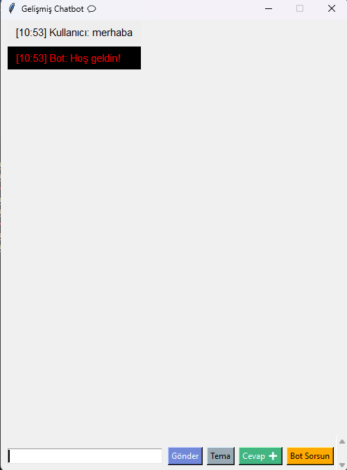
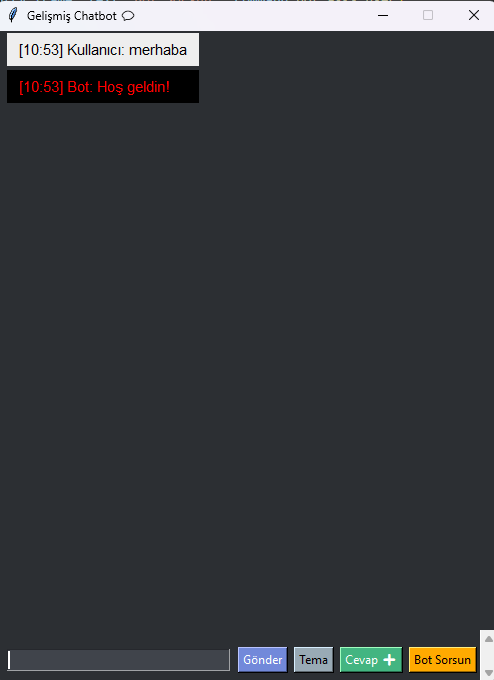
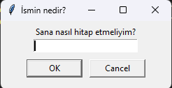

# SimpleChatbotwithPython# Python Chatbot Uygulaması

Bu proje, Python kullanılarak geliştirilmiş bir **Chatbot** uygulamasıdır. 
Uygulama, kullanıcı ile etkileşimli bir sohbet gerçekleştirebilir, temalar arasında geçiş yapabilir, dinamik cevaplar verebilir, hatırlatıcılar ekleyebilir ve birçok eğlencelik özellik sunar.

## Özellikler

- **Koyu/Açık Tema**: Kullanıcı tema değiştirebilir. Koyu modda arka plan siyah, yazılar beyazdır. Açık modda ise arka plan beyaz, yazılar siyah olacaktır.
- **Cevapların Doğallığı**: Chatbot, kullanıcıdan gelen sorulara doğal ve çeşitlendirilmiş cevaplar vermek için **random** fonksiyonu kullanır.
- **Dinamik Cevaplar**: Tarih, saat gibi bilgileri kullanarak dinamik cevaplar verebilir.
- **Kullanıcı Kişiselleştirme**: Uygulama ilk açıldığında kullanıcıdan ismi alınır ve bu isimle sohbet başlatılır.
- **Dış Dosyadan Cevaplar Okuma**: Cevaplar ve bazı eğlencelikler dış bir JSON dosyasından okunur ve kaydedilebilir.
- **Mesaj Zaman Damgası**: Her mesaj zaman damgası ile birlikte görüntülenir.
- **Cevapları Dışardan Güncelleyebilme**: Kullanıcı, chatbot cevaplarını dışardan **JSON** dosyası aracılığıyla güncelleyebilir.
- **Botun Kullanıcıya Sorması**: Chatbot, rastgele sorular sorarak kullanıcıyla etkileşimi arttırır.
- **Hatırlatıcı/ Ajanda Özelliği**: Kullanıcı, hatırlatıcılar ekleyebilir ve bunları görebilir.
- **Minik Eğlencelikler**: Zar atma, burç yorumu ve bilmeceler gibi eğlencelikler de mevcut.

## Kurulum ve Kullanım

### Gereksinimler

Bu uygulama için aşağıdaki Python kütüphanelerine ihtiyacınız olacak:

- `tkinter`
- `json`
- `random`
- `datetime`
- `os`

### Adımlar

1. **Kodu İndir**:
   - Bu proje için gerekli olan dosyaları indirebilirsiniz. 

2. **Dosyaları Kurun**:
   - Eğer eksik dosyalar varsa (`responses.json`, `riddles.json`, `reminders.json`), ilk kez çalıştırıldığında bu dosyalar otomatik olarak oluşturulacaktır.

3. **Projeyi Çalıştırın**:
   - Projeyi başlatmak için terminal üzerinden aşağıdaki komutu çalıştırın:

     ```bash
     python chatbot.py
     ```

4. **Kullanıcı Etkileşimi**:
   - İlk açılışta kullanıcı adı sorulacak.
   - Ardından tema seçebilirsiniz.
   - Sohbete başlamak için metin kutusuna mesajınızı yazın.

5. **Tema Değiştirme**:
   - Tema değiştirmek için "Tema" butonuna tıklayın. Koyu ve açık tema arasında geçiş yapabilirsiniz.

6. **Cevapları Güncelleme**:
   - Cevapları güncellemek için "Cevap ➕" butonuna tıklayabilirsiniz. Kullanıcıdan gelen kelimelere göre chatbot cevabı ekleyebilirsiniz.

7. **Bot Soruları**:
   - "Bot Sorsun" butonuna tıklayarak botun size rastgele bir soru sormasını sağlayabilirsiniz.

8. **Hatırlatıcı Ekleme ve Görüntüleme**:
   - "Hatırlatıcı ekle" komutu ile hatırlatıcı ekleyebilir ve "Hatırlatıcıları göster" komutu ile eklediğiniz hatırlatıcıları görüntüleyebilirsiniz.

## Dosya Yapısı

- `chatbot.py`: Ana Python dosyası.
- `responses.json`: Botun cevaplarını sakladığı dosya.
- `riddles.json`: Bilmeceleri sakladığı dosya.
- `reminders.json`: Hatırlatıcıları sakladığı dosya.


## 🖼️ Arayüz Görünümü

| Açık Tema | Karanlık Tema | İsim sorma ekranı|
|----------|----------------|
|  |  |  |
## Katkıda Bulunma

Bu projeye katkıda bulunmak isterseniz, aşağıdaki adımları takip edebilirsiniz:

1. Bu projeyi çatallayın.
2. Geliştirmelerinizi yapın.
3. Pull request oluşturun.